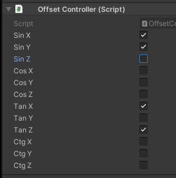

# TrigonometricCubes

## Description

Procedural animation with the possibility of offsetting using trigonometric functions on Unity3d.

By using params you can effect on start, middle, end points by Sin, Cos, Tan, Ctg functions.
Params meens that x, y, z from cube position applies to trigonometric function,
then result puts to point like offset.

## Getting Started

These instructions will get you a copy of the project up and running on your local machine for development and testing purposes.
See deployment for notes on how to deploy the project on a live system.

### TODO

1. Clone repo
2. Locate in Unity Hub
3. Open project
4. Enjoy

## Author

* **Andrii Bondarenko** - [PraydE](https://github.com/PraydE007)

### No params (Clean) | Sin X Z

### Tan X Y Z | Cos Z Tan X Z

